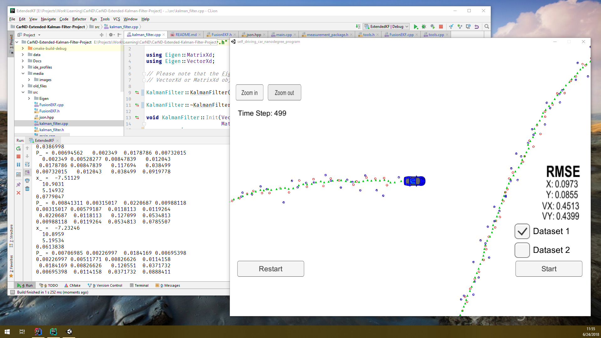

**Extended Kalman Filter Project**

## Writeup

### Introduction

The goals/steps of this project are the following:

* Utilize a Kalman filter to estimate the state of a moving object of interest
* With noisy RADAR/LIDAR measurements
* Obtaining RMSE values less than/equal to [.11, .11, 0.52, 0.52].

### Environment

Minimum execution environment is undefined.

Project was developed using the following environment:

| Category | Item        |
|----------|-------------|
| OS       | Windows 10 |
| CPU      | Intel i7/6800k |
| RAM      | 64GB |
| GPU      | nVidia GTX 1060 |
| VRAM     | 6GB |
| Storage  | SATA SSD |
| IDE      | JetBrains CLion (and) Linux for Windows (Ubuntu) |

### Execution

This capability includes of the following source code files modified for this project:
* [FusionEKF.cpp](./src/FusionEKF.cpp) implements sensor fusion functionality. Kalman filter initialization and prediction workflow code has been added here.
* [kamlan_filter.cpp](./src/kamlan_filter.cpp) implements the Kalman filter iteself. Update and prediction code has been added here.
* [tools.cpp](./src/tools.cpp) implements support capabilities. RMSE and Jacobian matrix code has been added here.

Almost all additions have been derived from project source material.

This remainder of source code/configuration files were provided with the project template.

#### term2_sim.exe

A running Term 2 simulator is necessary for evaluation of this capability.

##### Obtaining

Obtain the Term 2 simulator via its Github [repo](https://github.com/udacity/self-driving-car-sim/releases/).

##### Running

Once target environment perquisites are met, the simulator may be executed as a standalone application within the OS.

Once the simulator is running, select the "Project 1/2: EKF and UKF" scenario to prepare for evaluation.


#### ExtendedKF

The capability is built from this project source code as a standalone application named "ExtendedKF".

##### Obtaining / Building

Obtain this capability via its Github [repo](https://github.com/michael-kitchin/CarND-Extended-Kalman-Filter-Project).

Build using OS-specific `cmake` and `make` commands.

Windows build shown (via JetBrains CLion):
```
/usr/bin/cmake --build /mnt/[...]/CarND-Extended-Kalman-Filter-Project/cmake-build-debug --target ExtendedKF -- -j 6
Scanning dependencies of target ExtendedKF
[ 40%] Building CXX object CMakeFiles/ExtendedKF.dir/src/main.cpp.o
[ 60%] Building CXX object CMakeFiles/ExtendedKF.dir/src/tools.cpp.o
[ 80%] Building CXX object CMakeFiles/ExtendedKF.dir/src/FusionEKF.cpp.o
[ 80%] Building CXX object CMakeFiles/ExtendedKF.dir/src/kalman_filter.cpp.o
[100%] Linking CXX executable ExtendedKF
[100%] Built target ExtendedKF
```

##### Running

Once built, execute "ExtendedKF" from the command line.

Windows execution shown (via JetBrains CLion):
```
/mnt/[...]/CarND-Extended-Kalman-Filter-Project/cmake-build-debug/ExtendedKF
Listening to port 4567
Connected!!!
```

Once "ExtendedKF" is running and indicating connection, start the simulator run as shown:




Video of the entire build/run cycle may be found [here](./media/videos/build-and-run-1.mp4).

---

## Rubric Points

### [Rubric Points](https://review.udacity.com/#!/rubrics/748/view) are discussed individually with respect to the implementation.

---

### 1. Compiling

#### 1.1 Your code should compile.

_Code must compile without errors with cmake and make. Given that we've made CMakeLists.txt as general as possible, it's recommended that you do not change it unless you can guarantee that your changes will still compile on any platform._

See instructions and [video](./media/videos/build-and-run-1.mp4), above.

---

### 2. Accuracy

#### 2.1 px, py, vx, vy output coordinates must have an RMSE <= [0.11, 0.11, 0.52, 0.52] (...).

_Your algorithm will be run against Dataset 1 in the simulator which is the same as "data/obj_pose-laser-radar-synthetic-input.txt" in the repository. We'll collect the positions that your algorithm outputs and compare them to ground truth data. Your px, py, vx, and vy RMSE should be less than or equal to the values [.11, .11, 0.52, 0.52]._

Net accuracy as demonstrated is approximately [0.09, 0.09, 0.45, 0.44].

---

### 3. Follows the Correct Algorithm

#### 3.1 Your Sensor Fusion algorithm follows the general processing flow (...).

_While you may be creative with your implementation, there is a well-defined set of steps that must take place in order to successfully build a Kalman Filter. As such, your project should follow the algorithm as described in the preceding lesson._

[main.cpp](./src/main.cpp) encapsulates the initialize, measure, predict, and repeat process described in preceding lessons as follows:
1. Receives simulator data packets
1. Demarshals from JSON
1. Captures and tailors measurements according to source (RADAR, LIDAR)
1. Updates Kalman filter and generates predictions
1. Calculates RMSE based on prediction deviation from measurement

#### 3.2 Your Kalman Filter algorithm handles the first measurements appropriately.

_Your algorithm should use the first measurements to initialize the state vectors and covariance matrices._

Initialization is performed in the constructor and `ProcessMeasurement` methods found in [FusionEKF.cpp](./src/FusionEKF.cpp). The `is_initialized_` member variable is used to mediate this initialization.

#### 3.3 Your Kalman Filter algorithm first predicts then updates.

_Upon receiving a measurement after the first, the algorithm should predict object position to the current timestep and then update the prediction using the new measurement._

Updates to the state transition matrix are performed in the `ProcessMeasurement` method found in [FusionEKF.cpp](./src/FusionEKF.cpp). Predictions are initiated there and performed in the `Predict` method found in [kalman_filter.cpp](./src/kalman_filter.cpp). Updates are subsequently performed in the `Update` method also found in [kalman_filter.cpp](./src/kalman_filter.cpp).

#### 3.4 Your Kalman Filter can handle radar and lidar measurements.

_Your algorithm sets up the appropriate matrices given the type of measurement and calls the correct measurement function for a given sensor type._

RADAR/LIDAR measurements are first discriminated by type in [main.cpp](./src/main.cpp), then in terms of prediction matrix and update preparation in the `ProcessMeasurement` method found in [FusionEKF.cpp](./src/FusionEKF.cpp).

---

### 4. Code Efficiency

#### 4.1 Your algorithm should avoid unnecessary calculations.

_This is mostly a "code smell" test. Your algorithm does not need to sacrifice comprehension, stability, robustness or security for speed, however it should maintain good practice with respect to calculations (...)._

This is mitigated by this project's constrained scope -- the structure of the codebase is predefined and core algorithm already developed during preceding lessons. That said, both the provided and developed code exclusively reflect the central use case and compiles, runs, and performs adequately in the target environment.